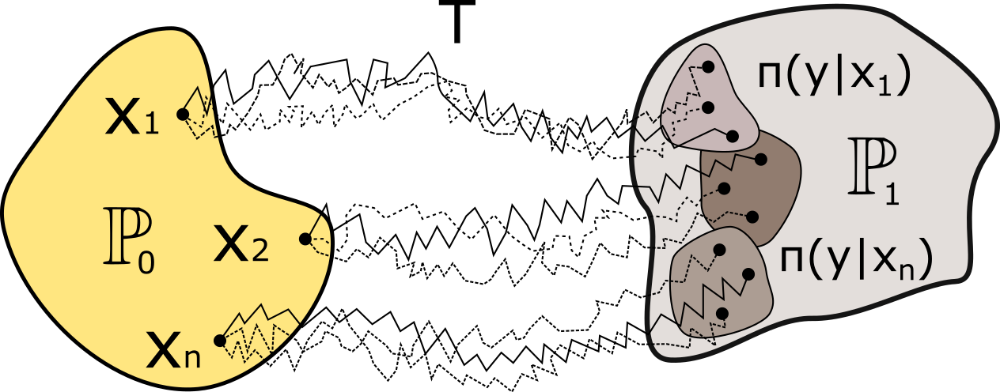

# Entropic Neural Optimal Transport via Diffusion Processes

This is the official Python implementation of the NeurIPS 2023 paper [*Entropic Neural Optimal Transport via Diffusion Processes*](https://papers.nips.cc/paper_files/paper/2023/hash/eeac51414a11484d048432f614d5bb1b-Abstract-Conference.html) by [Nikita Gushchin](https://scholar.google.com/citations?user=UaRTbNoAAAAJ), [Alexander Kolesov](https://scholar.google.com/citations?user=WyAI_wUAAAAJ), [Alexander Korotin](https://scholar.google.com/citations?user=1rIIvjAAAAAJ), [Dmitry Vetrov](https://scholar.google.com/citations?user=7HU0UoUAAAAJ) and [Evgeny Burnaev](https://scholar.google.com/citations?user=pCRdcOwAAAAJ).

<p align="center"></p>

## Citation

If you find this repository or the ideas presented in our paper useful, please consider citing our paper.

```
@inproceedings{
gushchin2023entropic,
title={Entropic Neural Optimal Transport via Diffusion Processes},
author={Nikita Gushchin and Alexander Kolesov and Alexander Korotin and Dmitry P. Vetrov and Evgeny Burnaev},
booktitle={Thirty-seventh Conference on Neural Information Processing Systems},
year={2023},
url={https://openreview.net/forum?id=fHyLsfMDIs}
}
```

## Repository structure
The implementation is GPU-based with the multi-GPU support.

All the experiments are issued in the form of pretty self-explanatory jupyter notebooks (`notebooks/`). For convenience, the majority of the evaluation output is preserved. Auxilary source code is moved to `.py` modules (`src/`). 

Note that we use `wandb` ([link](https://wandb.ai/site)) dashboard system when launching our experiments. The practitioners are expected to use `wandb` too. 

- ```notebooks/Toy_experiments.ipynb``` - Toy experiments.
- ```notebooks/High_dimensionsal_gaussians.ipynb``` - Experiments with high dimensional gaussians.
- ```stats/compute_stats.ipynb``` - Precomputing stats for FID evalution for colored MNIST and Celeba (you need to run it before experiments with images).
- ```notebooks/Image_experiments.ipynb``` - Training ENOT for colored MNIST and Celeba.
- ```notebooks/Discrete_OT.ipynb``` - Calculating discrete OT mappings.
- ```notebooks/MNIST_plotting.ipynb``` - Plotting ENOT and discrete OT results for colored MNIST.
- ```notebooks/Celeba_plotting.ipynb``` - Plotting ENOT results for Celeba.

## Datasets
- Colored MNIST. Custom dataseted obtained by coloring each MNIST digith in a random color;
- [CelebA faces](https://mmlab.ie.cuhk.edu.hk/projects/CelebA.html) requires ```datasets/list_attr_celeba.ipynb```;

The dataloaders can be created by ```load_dataset``` function from ```src/tools.py```. The latter four datasets get loaded directly to RAM.
